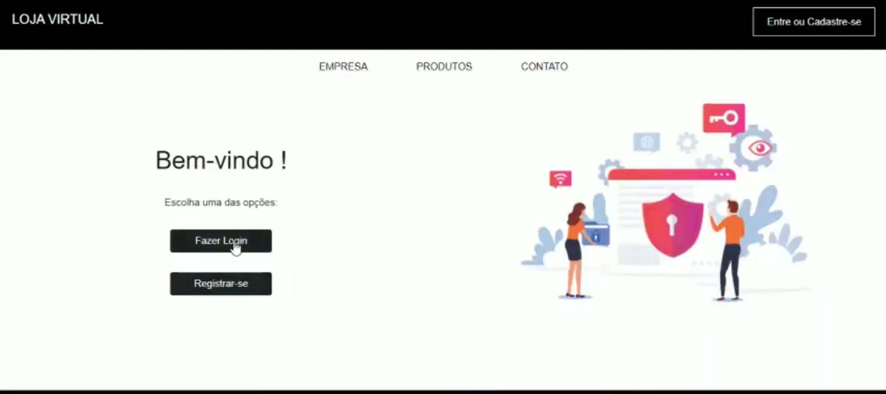
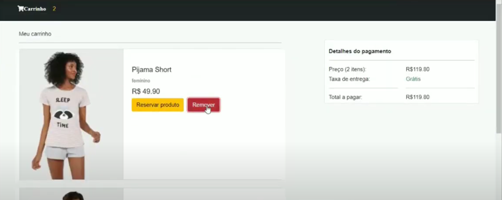

# Loja online de roupas

Trabalho realizado no primeiro semestre de 2021 para a disciplina de Desenvolvimento Web I do curso de Tecnologia em Análise e Desenvolvimento de Sistemas da UFPR. O objetivo é o desenvolvimento inicial de um sistema de loja online de roupas usando HTML, CSS, JS, PHP e MySQL.

**Integrantes do grupo:**
- _Karine Antoniacomi dos Santos_
- _Pietro Prá Giacomitti_
- _Robson Mariano Euzébio de Oliveira_

